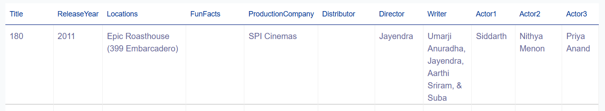
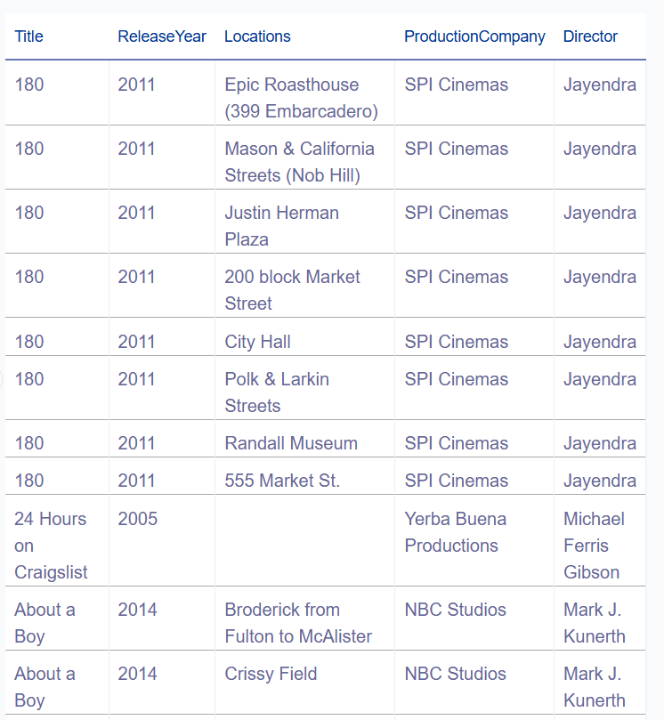
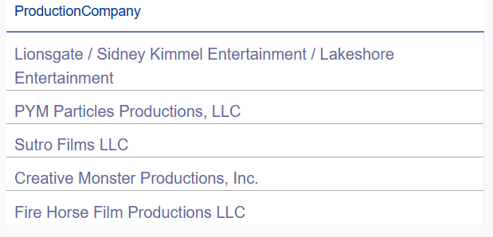
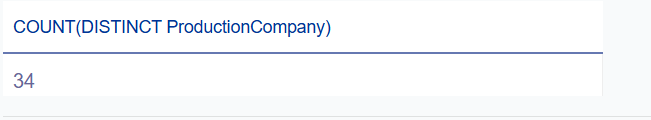
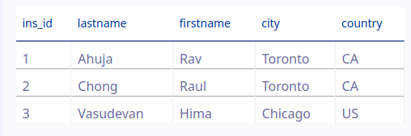
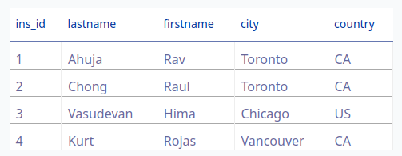
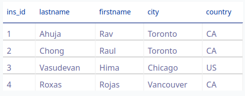
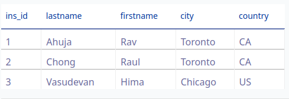
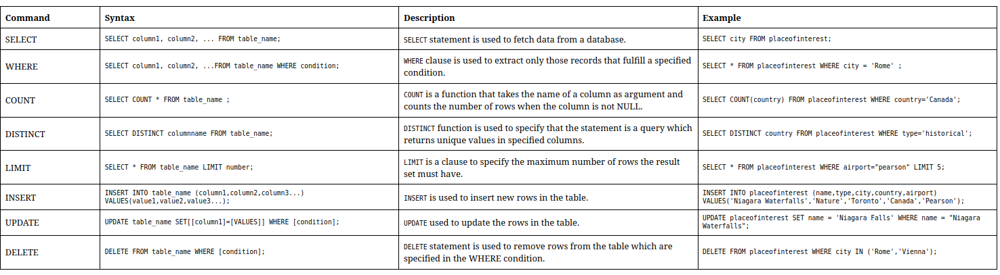

## Module 1
- SQL language for relational database (used to query data from database)
- database: repository of data with querying functionality
- data stored as tables (rows and columns)
- table is a collection of related things
- relationships can exists between tables
- dbms (database management  system): tools to manage data (rdms for relational)
- rdbms examples: MySQL, Oracle database, IBM db2

basic commands
- create table
- insert
- select
- update
- delete

What is sql, data, database, relational database, rdbms, 5 basic sql commands

### `select` statement

goal

- retrieve data from relational database
- define the use of a predicate
- identify the syntax of the `SELECT` statement using the `WHERE` clause
- list comparison operators supported by RDMS

**How to use SELECT**

`select * from Book` for all attributes

`select book_id, title, edition, year from Book` for selected attributes (subset of the columns)

**Restrict the results set**

- predicate: a conditonal statement leading to True, False, Unknown and is used for the WHERE

`select book_id, title from Book WHERE book_id='B1"`

- there are other comparison operators (<, >, etc)

**Hands-on select statements**

`SELECT * FROM FilmLocations;`



`SELECT Title, ReleaseYear, Locations, ProductionCompany, Director FROM FilmLocations WHERE ReleaseYear>=2000;`



### COUNT, DISTINCT, LIMIT

**COUNT**

- `select COUNT(*) from tablename`

**DISTINCT**

- `select DISTINCT columnname from tablename`

**LIMIT**

- restrict the number of rows retreived from the database
- `select * from tablename LIMIT 10`
- `select * from MEDALS where YEAR = 2018 LIMIT 5

**Hands-on select statement**

`SELECT COUNT(DISTINCT ProductionCompany) FROM FilmLocations WHERE ReleaseYear >= 2015 LIMIT 5`



`SELECT COUNT(DISTINCT ProductionCompany) FROM FilmLocations WHERE ReleaseYear >= 2015;`


 

### INSERT statement

```sql
INSERT INTO AUTHOR
    (AUTHOR_ID, LASTNAME, FIRSTNAME, EMAIL, CITY, COUNTRY)
VALUES ('A1', 'Chong', 'Raul', 'rfc@ibm.com', 'Toronto', 'CA')
```

**multiple insert**

```sql
INSERT INTO AUTHOR
    (AUTHOR_ID, LASTNAME, FIRSTNAME, EMAIL, CITY, COUNTRY)
VALUES ('A1', 'Chong', 'Raul', 'rfc@ibm.com', 'Toronto', 'CA')
VALUES ('A1', 'Smith', 'Smith', 'ra@ibm.com', 'Toronto', 'CA')
```

### UPDATE and DELETE statement

**UPDATE**

```sql
UPDATE AUTHOR SET LASTNAME='KATTA' FIRSTNAME='LAKSHMI' WHERE AUTHOR_ID='A2'
```

**DELETE**

```sql
DELETE FROM AUTHOR 
  WHERE AUTHOR_ID='A2'
```

```sql
DELETE FROM AUTHOR 
  WHERE AUTHOR_ID IN ('A1', 'A2')
```


**Hands-on INSERT, UPDATE, DELETE statements**

`SELECT * From Instructor;`



```sql
INSERT INTO Instructor 
    (ins_id, lastname, firstname, city, country)
VALUES (4, 'Kurt', 'Rojas', 'Vancouver', 'CA')
```




```sql
update Instructor set lastname='Roxas' where ins_id=4
```




```sql
delete from Instructor where ins_id=4
```



### Summary

- Data manipulation language (DML) statements read and modify data 
- The search condition of the WHERE clause uses a predicate to refine the search
- The SQL retrieves specific data from the database
- INSERT, UPDATE, and DELETE statements are DML statements for adding/modifying tables




## Module 2 - Introduction to relational databases and tables


### Relational database concepts

**Relational model**

- most used data model 
- allows for data independence 
- data is stored in tables

*logical data independence, physical data independence, physical storage independence*

**Entity relational diagrams (ERD)**

- relationships between entities (tables)

**Entity-relationship model**

- used to design relational database structure
- entity = table 
- attibutes = columns and describes the entity. It is connected to only 1 entity
- Essentially, an entity is the table and attributes are the columns in the table
- columns can handle values of varchar, char, numeric

**Primary Keys and Foreign Keys**

- primary key uniquely identifies each row in a table to prevent duplicate rows/data
- Foreign keys are primary keys defined in another table to establish relationships between tables

**Summary**

- advantage of relational database is data independence
- Entities are independent objects which have attributes
- Entities map to tables in a relational database
- attributes map to columns in a table
- common data types are characters, numbers, dates/times
- primary keys uniquely identify each row in a table

### Types of SQL Statements (DDL vs DML)

- Data Definition Language (DDL) statements: 
  - define, change, drop data
  - CREATE, ALTER, TRUNCATE, DROP
- Data Manipulation Language (DML) statements:
  - read and modify data
  - SELECT, INSERT, UPDATE, DELETE 
  - CRUD operations (create, read, update, delete)

### CREATE TABLE statement

```sql
CREATE TABLE table_name
  (
  column_name_1 datatype optional_parameters, 
  column_name_2 datatype,
  ...
  column_name_n datatype
  )
```

**example**

```sql
CREATE TABLE provinces(
  id char(2) PRIMARY KEY NOT NULL,
  name varchar(24)
)
```


```sql
CREATE TABLE author(
  author_id CHAR(2) PRIMARY KEY NOT NULL,
  lastname VARCHAR(15) NOT NULL,
  firstname VARCHAR(15) NOT NULL,
  email VARCHAR(40),
  city VARCHAR(15),
  country CHAR(2),
)
```

### ALTER, DROP, and Truncate tables

ALTER: 
- Add/remove columns
- Modify the data types of the columns
- Add/remove keys
- Add/remove constraints

```sql
ALTER TABLE author
  MODIFY telephone_number CHAR(20)
  DROP COLUMN telephone_number
```

```sql
ALTER TABLE author
  DROP COLUMN telephone_number
```

```sql
DROP TABLE author
```

```sql
TRUNCATE TABLE author
  IMMIDIATE;
```

**Summary**

- ALTER TABLE changes the structure of an existing table (add/modify/drop columns)
- DROP TABLE deletes existing table 
- TRUNCATE TABLE deletes all rows of the data in a table

